

  <h3><code>hashim@github ~ $ whoami</code></h3>
  <table>
    <tr>
      <td valign="top" align="center">
        
      </td>
      <td valign="top" align="center">
        
      </td>
    </tr>
  </table>
    
  
  <h3><code>hashim@github ~ $ ./contributions.sh</code></h3>
  

